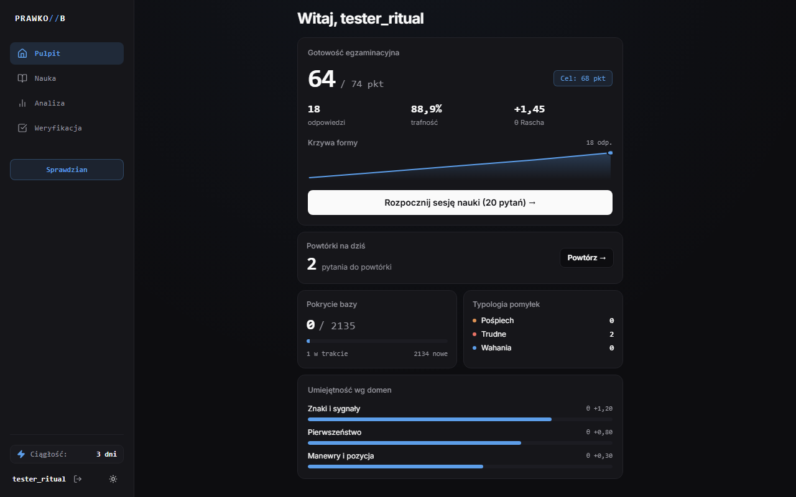
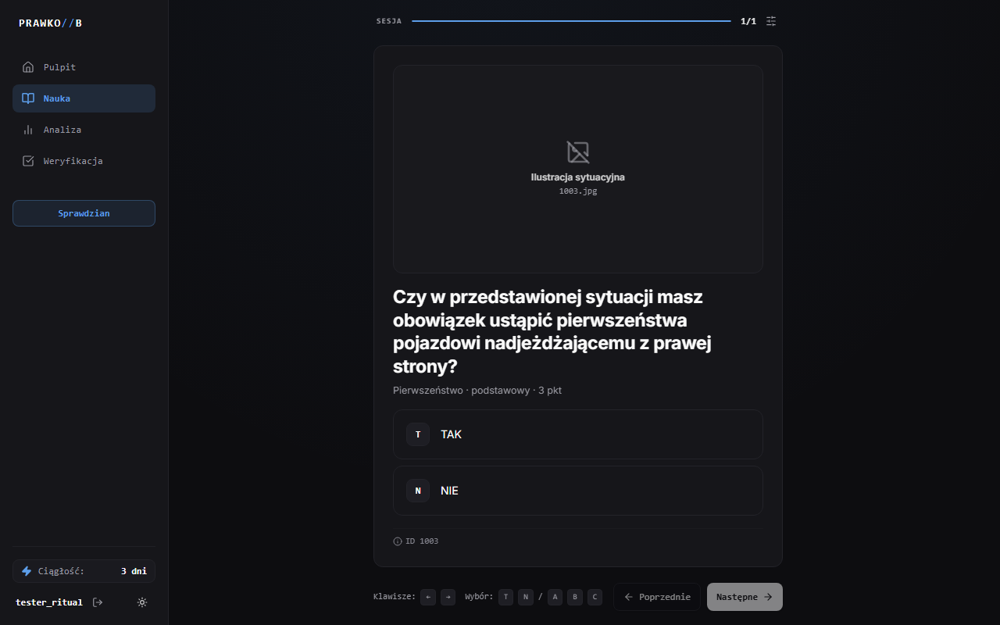

# Prawko B — Inteligentna platforma do nauki na prawo jazdy kat. B

[](https://github.com/a-false-god/b/actions/workflows/ci.yml)
[](LICENSE)
[](https://www.python.org/downloads/release/python-3130/)
[](https://react.dev/)
[](https://github.com/a-false-god/b/actions)

> **Prawko B** to responsywna, adaptacyjna aplikacja webowa do efektywnej nauki pełnej bazy 2 135 pytań państwowego egzaminu teoretycznego na prawo jazdy kategorii B (zgodna z oficjalnym katalogiem Ministerstwa Infrastruktury).

---

## Zrzuty ekranu

| Pulpit gotowości i analityka (Dark Mode) | Moduł nauki z wideo i skrótami klawiszowymi |
|:---:|:---:|
|  |  |

---

## Główne funkcje

### 🧠 Inteligentny kompozytor sesji nauki
- **Priorytetyzacja powtórek**: Sesje dynamicznie łączą pytania wymagające powtórki (~60% błędne oraz powtórki w interwale) z nowymi pytaniami (~40%).
- **Maksymalizacja punktów egzaminacyjnych**: Nowe pytania są sortowane według wagi punktowej (3 pkt $\to$ 2 pkt $\to$ 1 pkt), co pozwala szybko zabezpieczyć ~65% punktów egzaminacyjnych.
- **Przeplatanie dziedzin (Interleaving)**: Algorytm rotuje pytania pomiędzy 8 domenami tematycznymi (Oś B), zapobiegając monotonii i wzmacniając transfer wiedzy.

### 📈 Model biegłości Rascha ($\theta$) i retencja
- **Pomiar trudności pytań i umiejętności użytkownika**: Ciągła estymacja biegłości $\theta$ (Rasch IRT) w ujęciu globalnym oraz dla poszczególnych domen.
- **Reguła trwałego opanowania (Mastery)**: Pytanie uznaje się za opanowane dopiero po poprawnych odpowiedziach w co najmniej 2 różnych dniach kalendarzowych.
- **Wygaszanie nieaktywnych dziedzin (Decay)**: Brak powtórek w danej domenie powoduje stopniowe obniżanie wskaźnika gotowości.

### ⏱️ Pełna symulacja oficjalnego egzaminu państwowego
- **Zgodność z przepisami WORD**: Dokładny arkusz 32 pytań (20 podstawowych T/N: 10×3pkt, 6×2pkt, 4×1pkt + 12 specjalistycznych ABC: 6×3pkt, 4×2pkt, 2×1pkt).
- **Punktacja i czas**: Maksymalnie 74 punkty, próg zdawalności 68 punktów, limit czasu 25 minut.
- **Izolacja danych**: Próby egzaminacyjne są logowane niezależnie (`mode='sprawdzian'`), przygotowując bazę pod analizę IRT/HLR bez zniekształcania kolejki nauki.

### 🤖 Podwójny pas AI (Wyjaśnienia + Weryfikacja wizualna)
- **Rzetelna podstawa prawna**: Każde pytanie posiada zweryfikowane wyjaśnienie ze wskazaniem artykułu ustawy *Prawo o ruchu drogowym* lub właściwego rozporządzenia o znakach i sygnałach drogowych.
- **Vision Pass (Gemini 2.5 Flash)**: Zautomatyzowana inspekcja klatek wideo/animacji eliminująca halucynacje kontekstowe dla pytań sytuacyjnych.

### 📊 Zaawansowana analityka błędów i taksonomia
- **Trójwymiarowa taksonomia pytań**: Oś A (zapotrzebowanie poznawcze Bloom: pamięć/rozumienie/zastosowanie/analiza), Oś B (dziedziny tematyczne GDE), Oś C (pułapki językowe i jakość pytania).
- **Kategoryzacja Reason**: Automatyczny podział pomyłek na potknięcia (slips, czas <8s), błędy merytoryczne (mistakes, czas $\ge$8s) oraz niepewność (uncertainty, poprawne przy czasie >15s).

### 🎨 Design System Ritual v2
- Dopracowany interfejs w trybach **Dark Mode** i **Light Mode**, w pełni responsywny (Smartfony, Tablety, Desktop).
- Klawiaturocentryczna nawigacja (strzałki $\leftarrow$/$\rightarrow$, klawisze `1`–`4`, `T`/`N`, `A`/`B`/`C`, `Spacja`).
- Optymalizacja pod wolne łącza mobilne: pakiet fontów Inter ograniczony ściśle do podzbiorów Latin + Latin-Ext (**−41.6% dist gzip**, pełne polskie znaki `ąćęłńóśźż`).

---

## Szybki start

### Wymagania wstępne
- **Python 3.11+** (zalecany 3.13)
- **Node.js 20+** oraz `npm`

### 1. Uruchomienie lokalne (Development)

```bash
# 1. Klonowanie repozytorium
git clone https://github.com/a-false-god/b.git
cd b

# 2. Konfiguracja środowiska
cp .env.example .env

# 3. Instalacja zależności Pythona i uruchomienie backendu
pip install -r requirements.txt
uvicorn app.main:app --reload --port 8000
```

W osobnym terminalu (frontend):
```bash
cd frontend
npm install
npm run dev
```
Aplikacja uruchomi się pod adresem: `http://localhost:5173` (Vite) z proxy do API na porcie `8000`.

### 2. Uruchomienie w Dockerze (Produkcja / Kontener)

Projekt zawiera zoptymalizowany, wieloetapowy obraz Docker przystosowany do serwerów o małej ilości pamięci RAM (512 MB – 1 GB):

```bash
docker compose up -d --build
```
Aplikacja jest serwowana bezpośrednio na `http://localhost:8000`.

> **Wskazówka LAN (Nauka na telefonie w domowym Wi-Fi):**
> Aby korzystać z aplikacji na smartfonie, uruchom backend na `0.0.0.0` lub przez Docker Compose i otwórz w przeglądarce telefonu adres `http://<IP_KOMPUTERA>:8000`.

---

## Testy i zapewnienie jakości

Projekt utrzymuje 100% pokrycia kluczowych ścieżek krytycznych, właściwości matematycznych oraz testów regresji wizualnej:

```bash
# Uruchomienie pełnego zestawu testów (80/80 green)
pytest -v

# Uruchomienie w środowisku bez przeglądarki GUI (CI / serwery bez X11)
SKIP_PLAYWRIGHT_TESTS=1 pytest -v
```

### Protokół regresji wizualnej (Playwright)
Testy weryfikują pixel-perfect rendering komponentów na powierzchniach desktop/mobile w trybie jasnym i ciemnym:
```bash
# Uruchomienie testów regresji wizualnej
pytest tests/e2e/test_visual_regression.py -v
```
> **Zasada:** Aktualizacja baseline'ów wizualnych (`--update-baseline`) może być przeprowadzona **wyłącznie** po uprzedniej manualnej weryfikacji aplikacji na żywo i świadomej akceptacji zmian wizualnych.

---

## Bezpieczeństwo i Niezawodność

- **Trwałe sesje w SQLite WAL**: Sesje użytkowników przechowywane są w tabeli `user_sessions`, przetrzymując restarty kontenera.
- **Ochrona przed brute-force**: Inteligentny rate-limiter (5 prób/min na rzeczywisty IP) z poprawną obsługą zaufanych nagłówków `X-Forwarded-For` (`TRUSTED_PROXIES`).
- **Ochrona rejestracji (`REGISTRATION_KEY`)**: Możliwość zablokowania publicznej rejestracji tokenem zaproszeniowym.
- **Optymalizacja SQLite pod 1 GB RAM**: Włączone pragmy `synchronous=NORMAL`, `cache_size=-8000` (8 MB w pamięci RAM), `temp_store=MEMORY`, `mmap_size=32 MB`.
- **Niezmienne nagłówki pamięci podręcznej**: Pliki `/media/` serwowane są z nagłówkiem `Cache-Control: public, max-age=31536000, immutable`.
- **Kopie zapasowe**: Zintegrowany mechanizm kopii zapasowych SQLite Online Backup API (`tools/backup_db.py`) z retencją (14 dniowych + 4 tygodniowe) oraz synchronizacją `rclone`.

---

## Wdrożenie produkcyjne (VPS / Oracle Cloud Always Free)

Aplikacja jest zoptymalizowana do pracy na bezpłatnych instancjach chmurowych (np. Oracle Cloud E2.1.Micro 1 GB RAM / A1.Flex ARM64):

1. **Konfiguracja DNS**: Skieruj domenę (np. `prawko.twojadomena.pl`) na IP serwera.
2. **Reverse Proxy & TLS**: Rekomendowane użycie serwera **Caddy 2** (automatyczny certyfikat Let's Encrypt, HTTP/2, kompresja zstd/gzip).
3. **Pliki mediów**: Prześlij katalog `media/` (~2 GB) oraz bazę SQLite przez `rsync`:
   ```bash
   rsync -avz --progress ./media/ ubuntu@<VPS_IP>:~/b/media/
   ```
4. **Uruchomienie**:
   ```bash
   docker compose up -d --build
   ```

---

## Nota prawna i licencjonowanie

- **Kod źródłowy**: Całość autorskiego kodu aplikacji (backend FastAPI, frontend React, skrypty analityczne) udostępniona jest na licencji **[MIT](LICENSE)**.
- **Baza pytań egzaminacyjnych**: Teksty pytań i odpowiedzi pochodzą z oficjalnego katalogu Ministerstwa Infrastruktury i podlegają licencji **CC BY-SA 4.0**.
- **Materiały multimedialne (klipy wideo, zdjęcia, animacje)**: Materiały egzaminacyjne udostępnione przez Ministerstwo Infrastruktury podlegają licencji **CC BY-NC-ND 4.0** (Uznanie autorstwa — Użycie niekomercyjne — Bez utworów zależnych).
- **Status repozytorium**: Repozytorium **nie hostuje ani nie dystrybuuje** plików multimedialnych objętych prawami autorskimi. Aplikacja przeznaczona jest do użytku niekomercyjnego w zamkniętych instalacjach self-hosted.
